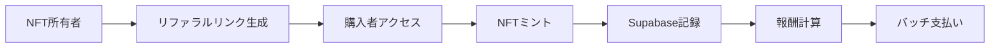

# リファラルシステム実装仕様書

## 📋 概要

NFT所有者が紹介リンクを生成し、そのリンクからの購入に対して報酬を獲得できるシステム。

## 🎯 ビジネス要件

### 機能要件
1. **リファラルリンク生成**
   - NFT所有者のみリンク生成可能
   - 特定NFTのミント時に自動生成オプション
   - リンクの有効期限設定（デフォルト30日）

2. **報酬システム**
   - ミント価格の X% を紹介者に還元
   - 最小報酬額の設定（ガス代対策）
   - 週次/月次バッチ支払い

3. **管理機能**
   - 紹介実績ダッシュボード
   - 報酬履歴
   - 不正検知機能

## 🏗️ システムアーキテクチャ

### 技術スタック
```
Frontend: Next.js + TypeScript
Backend: Supabase (PostgreSQL + Edge Functions)
Blockchain: Polygon
Payment: USDC/ZENY/POL
```

### データフロー


## 📊 データベース設計

### Supabase Tables

```sql
-- 1. リファラルコード管理
CREATE TABLE referral_codes (
  id UUID PRIMARY KEY DEFAULT gen_random_uuid(),
  code VARCHAR(10) UNIQUE NOT NULL,
  owner_address VARCHAR(42) NOT NULL,
  token_id INTEGER,
  created_at TIMESTAMP DEFAULT NOW(),
  expires_at TIMESTAMP,
  is_active BOOLEAN DEFAULT true,
  total_uses INTEGER DEFAULT 0,
  max_uses INTEGER DEFAULT NULL,
  CONSTRAINT valid_address CHECK (owner_address ~* '^0x[a-fA-F0-9]{40}$')
);

-- 2. リファラル実績
CREATE TABLE referral_transactions (
  id UUID PRIMARY KEY DEFAULT gen_random_uuid(),
  referral_code VARCHAR(10) REFERENCES referral_codes(code),
  buyer_address VARCHAR(42) NOT NULL,
  referrer_address VARCHAR(42) NOT NULL,
  token_id INTEGER NOT NULL,
  mint_quantity INTEGER NOT NULL,
  mint_price DECIMAL(20, 6) NOT NULL,
  currency VARCHAR(10) NOT NULL,
  reward_percentage INTEGER NOT NULL,
  reward_amount DECIMAL(20, 6) NOT NULL,
  tx_hash VARCHAR(66) UNIQUE,
  block_number BIGINT,
  status VARCHAR(20) DEFAULT 'pending',
  created_at TIMESTAMP DEFAULT NOW(),
  paid_at TIMESTAMP,
  CONSTRAINT valid_status CHECK (status IN ('pending', 'calculated', 'paid', 'failed', 'cancelled'))
);

-- 3. 報酬支払い履歴
CREATE TABLE reward_payments (
  id UUID PRIMARY KEY DEFAULT gen_random_uuid(),
  batch_id VARCHAR(20) UNIQUE NOT NULL,
  referrer_address VARCHAR(42) NOT NULL,
  transaction_ids UUID[] NOT NULL,
  total_amount DECIMAL(20, 6) NOT NULL,
  currency VARCHAR(10) NOT NULL,
  payment_tx_hash VARCHAR(66),
  gas_fee DECIMAL(20, 6),
  status VARCHAR(20) DEFAULT 'pending',
  created_at TIMESTAMP DEFAULT NOW(),
  executed_at TIMESTAMP,
  notes TEXT
);

-- 4. リファラル統計（集計用）
CREATE TABLE referral_stats (
  referrer_address VARCHAR(42) PRIMARY KEY,
  total_referrals INTEGER DEFAULT 0,
  total_mints INTEGER DEFAULT 0,
  total_earned_usdc DECIMAL(20, 6) DEFAULT 0,
  total_earned_zeny DECIMAL(20, 6) DEFAULT 0,
  total_earned_pol DECIMAL(20, 6) DEFAULT 0,
  last_referral_at TIMESTAMP,
  updated_at TIMESTAMP DEFAULT NOW()
);

-- インデックス
CREATE INDEX idx_referral_codes_owner ON referral_codes(owner_address);
CREATE INDEX idx_referral_transactions_referrer ON referral_transactions(referrer_address);
CREATE INDEX idx_referral_transactions_status ON referral_transactions(status);
CREATE INDEX idx_reward_payments_referrer ON reward_payments(referrer_address);
```

## 🔧 実装詳細

### 1. リファラルコード生成

```typescript
// /app/api/referral/generate/route.ts
export async function POST(req: Request) {
  const { address, tokenId } = await req.json();
  
  // NFT所有権確認
  const isOwner = await checkNFTOwnership(address, tokenId);
  if (!isOwner) {
    return NextResponse.json({ error: 'Not NFT owner' }, { status: 403 });
  }
  
  // 一意のコード生成（6文字）
  const code = generateUniqueCode();
  
  // Supabaseに保存
  const { data, error } = await supabase
    .from('referral_codes')
    .insert({
      code,
      owner_address: address,
      token_id: tokenId,
      expires_at: new Date(Date.now() + 30 * 24 * 60 * 60 * 1000) // 30日後
    });
    
  return NextResponse.json({ 
    referralLink: `${process.env.NEXT_PUBLIC_BASE_URL}?ref=${code}`,
    code 
  });
}
```

### 2. ミント時のリファラル処理

```typescript
// SimpleMint.tsx の修正
const handleMint = async () => {
  // URLパラメータからリファラルコード取得
  const urlParams = new URLSearchParams(window.location.search);
  const refCode = urlParams.get('ref');
  
  if (refCode) {
    // リファラルコード検証
    const { valid, referrerAddress } = await validateReferralCode(refCode);
    
    if (valid) {
      // ミント実行
      const tx = await mint(tokenId, quantity);
      
      // リファラル実績記録
      await recordReferral({
        code: refCode,
        buyerAddress: account.address,
        referrerAddress,
        tokenId,
        quantity,
        price: mintPrice,
        currency: currencySymbol,
        txHash: tx.hash
      });
    }
  }
};
```

### 3. 報酬計算と支払い

```typescript
// Supabase Edge Function: calculate-rewards
export async function calculateRewards() {
  // 未払い取引を取得
  const pendingTxs = await supabase
    .from('referral_transactions')
    .select('*')
    .eq('status', 'pending');
    
  // 紹介者ごとに集計
  const rewards = {};
  for (const tx of pendingTxs.data) {
    const reward = tx.mint_price * (tx.reward_percentage / 100);
    
    if (!rewards[tx.referrer_address]) {
      rewards[tx.referrer_address] = {
        usdc: 0,
        zeny: 0,
        pol: 0,
        transactions: []
      };
    }
    
    rewards[tx.referrer_address][tx.currency.toLowerCase()] += reward;
    rewards[tx.referrer_address].transactions.push(tx.id);
  }
  
  return rewards;
}

// 週次バッチ支払い処理
export async function processPayments() {
  const rewards = await calculateRewards();
  const batchId = `BATCH_${Date.now()}`;
  
  for (const [address, data] of Object.entries(rewards)) {
    // 最小支払額チェック（1 USDC相当）
    if (getTotalValueInUSDC(data) < 1) continue;
    
    // 支払い実行（オフチェーン or オンチェーン）
    const txHash = await sendRewardPayment(address, data);
    
    // 記録更新
    await supabase
      .from('reward_payments')
      .insert({
        batch_id: batchId,
        referrer_address: address,
        transaction_ids: data.transactions,
        total_amount: data.usdc, // または他の通貨
        currency: 'USDC',
        payment_tx_hash: txHash,
        status: 'paid'
      });
  }
}
```

## 🛡️ セキュリティ対策

### 1. 不正防止
```typescript
const ANTI_FRAUD_RULES = {
  // 自己紹介禁止
  selfReferral: false,
  
  // 1日あたりの最大紹介数
  maxReferralsPerDay: 10,
  
  // 同一IPからの複数アカウント検知
  checkDuplicateIP: true,
  
  // 最小ミント間隔（秒）
  minMintInterval: 60,
  
  // 疑わしいパターン検知
  suspiciousPatterns: [
    'rapid_mints',      // 短時間での大量ミント
    'same_amount',      // 同額の繰り返しミント
    'circular_referral' // 循環的な相互紹介
  ]
};
```

### 2. レート制限
```typescript
// API レート制限
export const rateLimiter = {
  generateCode: '5/hour/ip',
  validateCode: '100/hour/ip',
  recordReferral: '20/hour/address'
};
```

## 📊 Admin管理画面

### 新規タブ: リファラル管理

```typescript
// /app/admin/referrals/page.tsx
export default function ReferralAdmin() {
  return (
    <div>
      {/* 統計ダッシュボード */}
      <ReferralStats />
      
      {/* トップリファラー */}
      <TopReferrers />
      
      {/* 最近の取引 */}
      <RecentTransactions />
      
      {/* 支払い管理 */}
      <PaymentManagement />
      
      {/* 不正検知アラート */}
      <FraudAlerts />
    </div>
  );
}
```

## ⚠️ 実装前の確認事項

### 法的・規制
1. **税務処理**
   - 報酬の源泉徴収要否
   - 支払調書の発行義務
   - 各国の税法対応

2. **MLM規制**
   - 単階層のみ（多段階は違法リスク）
   - 報酬上限の設定
   - 利用規約での明記

3. **KYC/AML**
   - 高額報酬時の本人確認
   - 不正送金防止措置

### 技術的考慮
1. **ガス代最適化**
   - バッチ支払いで削減
   - Layer2活用検討

2. **スケーラビリティ**
   - データベース最適化
   - キャッシュ戦略

3. **監査とテスト**
   - セキュリティ監査
   - 負荷テスト

## 📈 KPI設定

```typescript
const REFERRAL_METRICS = {
  // 成功指標
  conversionRate: '10%',      // リファラルリンクからの購入率
  avgRewardPerUser: '50 USDC', // 平均報酬額
  userRetention: '60%',        // リファラー継続率
  
  // 監視指標
  fraudRate: '<1%',            // 不正率
  paymentDelay: '<7 days',     // 支払い遅延
  disputeRate: '<0.5%'         // 紛争率
};
```

## 🚀 実装ロードマップ

### Phase 1: 基盤構築（1週間）
- [ ] Supabaseセットアップ
- [ ] データベース作成
- [ ] 基本API実装

### Phase 2: リファラル機能（1週間）
- [ ] コード生成機能
- [ ] リンク検証機能
- [ ] ミント時記録

### Phase 3: 報酬システム（2週間）
- [ ] 報酬計算ロジック
- [ ] 支払い処理
- [ ] 履歴管理

### Phase 4: 管理機能（1週間）
- [ ] Admin画面
- [ ] 統計ダッシュボード
- [ ] 不正検知

### Phase 5: テスト・最適化（1週間）
- [ ] 統合テスト
- [ ] パフォーマンス最適化
- [ ] セキュリティ監査

## 📝 必要なリソース

1. **Supabaseプロジェクト**
   - Database
   - Edge Functions
   - Storage (レポート用)

2. **環境変数追加**
```env
# Supabase
NEXT_PUBLIC_SUPABASE_URL=
NEXT_PUBLIC_SUPABASE_ANON_KEY=
SUPABASE_SERVICE_ROLE_KEY=

# Referral Config
REFERRAL_REWARD_PERCENTAGE=10
REFERRAL_MIN_PAYOUT=1
REFERRAL_BATCH_SCHEDULE=weekly
```

3. **スマートコントラクト**
   - 報酬プール管理（オプション）
   - オンチェーン記録（オプション）

## 🔄 運用フロー

1. **日次タスク**
   - 不正検知モニタリング
   - 紛争対応

2. **週次タスク**
   - 報酬計算・承認
   - バッチ支払い実行
   - レポート作成

3. **月次タスク**
   - KPI分析
   - 報酬率の見直し
   - システム最適化

---

最終更新: 2025年8月25日
バージョン: 1.0.0