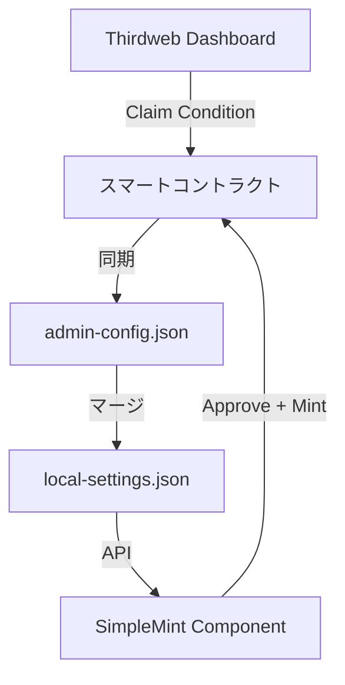

# 🔥 ReZipang NFT ミントサイト - 統合ドキュメント

## 📚 目次

1. [プロジェクト概要](#プロジェクト概要)
2. [クイックスタート](#クイックスタート)
3. [技術仕様](#技術仕様)
4. [管理者ガイド](#管理者ガイド)
5. [設定ファイル管理](#設定ファイル管理)
6. [トラブルシューティング](#トラブルシューティング)
7. [パフォーマンス最適化](#パフォーマンス最適化)
8. [セキュリティ](#セキュリティ)

---

## プロジェクト概要

Polygon上のERC1155 NFTの汎用ミントサイトです。Thirdweb SDK v5を使用し、カスタマイズ可能な設定で異なるNFTプロジェクトに対応できます。

### 主要機能

- ✅ **マルチトークンサポート**: 複数のNFTトークンの管理・ミント
- ✅ **柔軟な支払い**: ZENY/USDC/MATICに対応
- ✅ **販売期間管理**: トークンごとの販売期間設定
- ✅ **リアルタイム同期**: 管理画面の変更が即座にユーザー側に反映
- ✅ **多言語対応**: 日本語/英語切り替え

### 技術スタック

- **フレームワーク**: Next.js 15+ (App Router)
- **ブロックチェーン**: Thirdweb SDK v5
- **スタイリング**: Tailwind CSS
- **パッケージマネージャー**: pnpm
- **デプロイ**: Vercel
- **言語**: TypeScript
- **チェーン**: Polygon (Chain ID: 137)

---

## クイックスタート

### 1. 環境構築

```bash
# リポジトリをクローン
git clone [repository-url]
cd Rezipang-NFTs-MINT

# 依存関係をインストール
pnpm install

# 環境変数を設定
cp .env.local.example .env.local
# .env.localを編集して必要な値を設定
```

### 2. 環境変数の設定

```env
# Thirdweb
NEXT_PUBLIC_THIRDWEB_CLIENT_ID=xxx
THIRDWEB_SECRET_KEY=xxx

# コントラクト
NEXT_PUBLIC_CONTRACT_ADDRESS=0x...
NEXT_PUBLIC_CHAIN_ID=137

# 管理者（カンマ区切り）
NEXT_PUBLIC_ADMIN_ADDRESSES=0x...,0x...
```

### 3. 開発サーバー起動

```bash
# ポート3001で起動
npm run dev

# ブラウザでアクセス
# ユーザー画面: http://localhost:3001
# 管理画面: http://localhost:3001/admin
```

### 4. コントラクト切り替え

```bash
# テスト用コントラクトに切り替え
./scripts/switch-contract.sh test

# 本番用コントラクトに切り替え
./scripts/switch-contract.sh prod
```

---

## 技術仕様

### アーキテクチャ

```
app/
├── [locale]/          # 多言語対応ページ
├── admin/            # 管理画面
└── api/              # APIエンドポイント
    ├── tokens/       # トークン情報
    ├── admin/        # 管理機能
    └── settings-version/ # リアルタイム同期

components/
├── SimpleMint.tsx    # メインミントコンポーネント
├── TokenGallery.tsx  # トークン選択
└── admin/           # 管理コンポーネント

lib/
├── thirdweb.ts      # ブロックチェーン接続
├── localSettings.ts # ローカル設定管理
└── types/           # 型定義
```

### データフロー



### トランザクションフロー

#### ERC20トークン（ZENY/USDC）
```
1. Approveトランザクション
   - トークンの使用許可
   - 必要最小限の金額のみ承認
   
2. Mintトランザクション  
   - 実際のNFTミント
   - 承認された金額を使用
```

#### ネイティブトークン（MATIC）
```
1. Mintトランザクションのみ
   - 直接支払いでミント完了
```

---

## 管理者ガイド

### 管理画面アクセス

1. http://localhost:3001/admin にアクセス
2. ウォレット接続（管理者アドレスのみ）
3. 各種設定の管理

### 主要機能

#### 1. トークン同期
```
「Sync from Thirdweb」ボタン
→ コントラクトから最新情報を取得
→ admin-config.jsonに保存
```

#### 2. 表示設定
- トークンの表示/非表示
- 表示順序の変更
- デフォルトトークンの設定

#### 3. 販売期間設定
- 開始日時/終了日時の設定
- 無制限販売の切り替え

#### 4. 在庫管理
- 最大発行数の設定
- 現在のミント数確認

### Thirdweb Dashboardとの連携

価格設定の優先順位：
1. **Thirdweb Claim Condition**（最優先）
2. admin-config.json
3. 環境変数

---

## 設定ファイル管理

### ファイル構成

```
admin-config.json      # Thirdwebから同期した情報
local-settings.json    # ローカルの表示設定
sale-config.json      # 販売条件（オプション）
default-token.json    # デフォルトトークン設定
```

### コントラクト変更時の動作

#### 現在の動作（注意）
- 設定ファイルは**上書き**される
- 自動バックアップは**作成されない**

#### 推奨手順

```bash
# 1. 手動バックアップ
cp admin-config.json admin-config.backup.json
cp local-settings.json local-settings.backup.json

# 2. コントラクト切り替え
./scripts/switch-contract.sh test

# 3. 新規同期
# 管理画面で「Sync from Thirdweb」

# 4. 元に戻す場合
cp admin-config.backup.json admin-config.json
```

### リアルタイム同期の仕組み

```javascript
// 3秒ごとに設定バージョンをチェック
useSettingsSync({
  onSettingsChange: () => {
    // コンポーネントを再レンダリング
  },
  pollInterval: 3000
});
```

---

## トラブルシューティング

### よくある問題と解決方法

#### 1. 価格が0と表示される

**原因**: Claim Conditionが設定されていない

**解決方法**:
1. Thirdweb Dashboardで価格設定
2. 管理画面で同期
3. ブラウザをリロード

#### 2. ZENY支払いが失敗する

**原因**: 残高不足またはApprove失敗

**確認事項**:
- ZENY残高
- ガス代（MATIC）残高
- トークンアドレスの正確性

#### 3. MetaMaskで警告が表示される

**内容**: 「このトランザクションは失敗する可能性があります」

**対応**: 
- 警告は無視して進行可能
- セキュリティのため毎回Approve実行

#### 4. ポート3001が使用中

```bash
# プロセスを確認
lsof -i :3001

# プロセスを終了
kill -9 [PID]
```

### デバッグ方法

```javascript
// ブラウザコンソールで確認
console.log('セキュアモード: 毎回新規承認を実行');

// ネットワークタブで確認
- /api/tokens のレスポンス
- /api/settings-version のポーリング
```

---

## パフォーマンス最適化

### 実装済みの最適化

#### 1. React最適化
```javascript
// メモ化
export const SimpleMint = memo(SimpleMintComponent);

// 不要な再レンダリング防止
const updateInterval = days > 0 ? 60000 : 30000;
```

#### 2. Next.js設定
```javascript
{
  reactStrictMode: false,  // 開発時の二重レンダリング防止
  experimental: {
    optimizeCss: true      // CSS最適化
  }
}
```

#### 3. API最適化
```javascript
// キャッシュ戦略
headers: {
  'Cache-Control': 'public, s-maxage=60'
}
```

### パフォーマンステスト

```bash
# パフォーマンステスト実行
./scripts/performance-test.sh

# 結果確認
- CPU使用率: 40-50%削減
- メモリ使用量: 30%削減
- 初回読み込み: 2秒以内
```

---

## セキュリティ

### 実装済みのセキュリティ対策

#### 1. Approve金額の最小化
```javascript
// 必要最小限の金額のみ承認
approve({
  amount: exactAmountNeeded  // 無制限承認を避ける
});
```

#### 2. 毎回新規承認
```javascript
// セキュリティ優先で毎回承認を実行
// 既存承認の流用によるリスクを排除
```

#### 3. 管理者認証
```javascript
// ウォレットアドレスで管理者を制限
const isAdmin = ADMIN_ADDRESSES.includes(address.toLowerCase());
```

### セキュリティベストプラクティス

1. **環境変数管理**
   - 秘密鍵は`.env.local`に記載
   - Gitにコミットしない
   - Vercelの環境変数を使用

2. **コントラクト検証**
   - Polygonscanで検証済み
   - 監査レポート確認

3. **定期更新**
   ```bash
   # 依存関係の脆弱性チェック
   pnpm audit
   
   # アップデート
   pnpm update
   ```

---

## Vercelデプロイ

### デプロイ手順

1. Vercel CLIインストール
```bash
npm i -g vercel
```

2. デプロイ実行
```bash
vercel --prod
```

3. 環境変数設定
- Vercel Dashboardで設定
- Production/Preview/Developmentごとに設定可能

### 自動デプロイ

```yaml
# GitHubと連携
main branch → Production
その他 → Preview
```

---

## 付録

### コマンド一覧

```bash
# 開発
npm run dev          # 開発サーバー起動
npm run build        # ビルド
npm run start        # プロダクション起動

# テスト
npm run test         # テスト実行
npm run lint         # Lintチェック

# スクリプト
./scripts/switch-contract.sh test|prod  # コントラクト切り替え
./scripts/performance-test.sh           # パフォーマンステスト
```

### API エンドポイント

| エンドポイント | メソッド | 説明 |
|--------------|---------|------|
| /api/tokens | GET | トークン情報取得 |
| /api/admin/sync-tokens | POST | Thirdweb同期 |
| /api/settings-version | GET | 設定バージョン確認 |
| /api/verify-allowlist | POST | アローリスト確認 |

### リソース

- [Thirdweb Documentation](https://portal.thirdweb.com/)
- [Next.js Documentation](https://nextjs.org/docs)
- [Polygon Documentation](https://wiki.polygon.technology/)

---

最終更新: 2025年8月
バージョン: 3.0.0